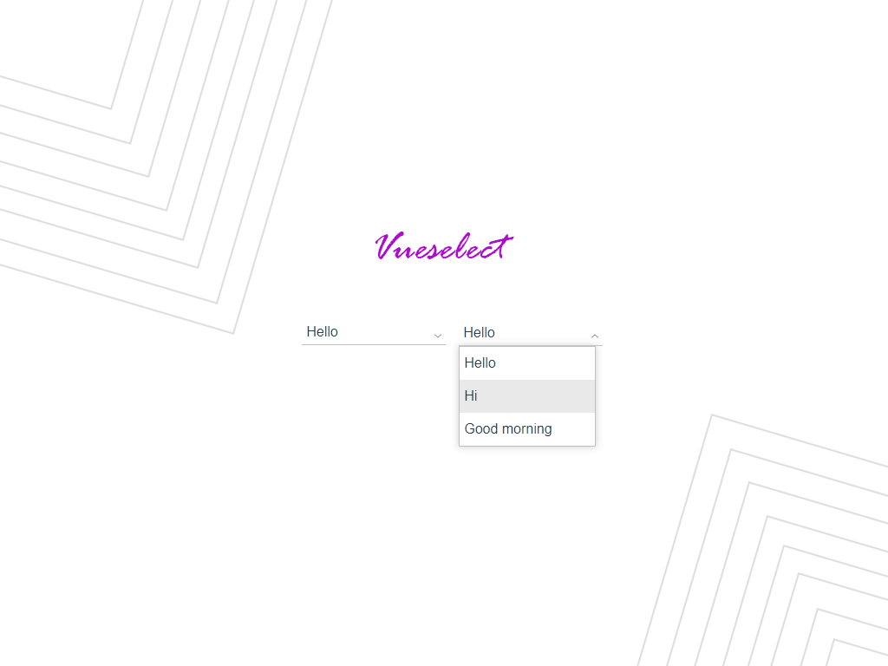

## Table of contents
* [General](#general)
* [Setup](#setup)
* [Usage](#usage)
* [Object options](#object-options)
* [Props](#props)
* [Slots](#slots)
* [Patch notes](#patch-notes)

# General
Simple select vue component, that allows you to control selected options from array

component is created with:
* Vue 2.6.10



# Setup
install module locally with npm or yarn

`npm i @pbartkowicz/vueselect`

or

`yarn add @pbartkowicz/vueselect`

# Usage
Import

```
import vueselect from '@pbartkowicz/vueselect'
```

Register in components section

```
components:{
    vueselect,
},
```

Define array with select options

```
data(){

    return{

        yourArrayWithOptions:[
            'option1',
            'option2',
            'option3'
        ],

        output: '',

    }

}
```
Use component in your code

```
<vueselect :options="yourArrayWithOptions" v-model="output"/>
```

You can always define array with objects

```
data(){

    return{

        yourArrayWithOptions:[
            {id: 1, name: 'option1'},
            {id: 2, name: 'option2'},
            {id: 3, name: 'option3'}
        ],

        output: '',

    }

}
```

And then use <b>label</b> prop for displayed value in select, and <b>reduce</b> prop for key in object for select output

```
<vueselect :options="yourArrayWithOptions" label="name" reduce="id" v-model="output"/>
```

For option named 'option2' output will be '2'

# Object options
When you will define array with objects, you can pass in to objects two options: 

| Option      | Type   | Default | Required | Description                                                                                 |
| ----------- | ------ | ------- | -------- | ------------------------------------------------------------------------------------------- |
| class       | String |         | No       | Name of class for option.                                                                   |
| hide        | Boolean|         | No       | Option to hide item.                                                                        |

```
data(){

    return{

        yourArrayWithOptions:[
            {id: 1, name: 'option1', class: 'your-class-for-option'},
            {id: 2, name: 'option2', hide: true},
            {id: 3, name: 'option3'}
        ],

        output: '',

    }

}
```

In this case 'option1' will have class "your-class-for-option" and 'option2' will not be displayed

# Props

| Prop        | Type   | Default | Required | Description                                                                                 |
| ----------- | ------ | ------- | -------- | ------------------------------------------------------------------------------------------- |
| options     | Array  |         | No       | Array with select options.                                                                  |
| label       | String |         | No       | Displayed value in select for array with objects.                                           |
| reduce      | String |         | No       | Select key in object for vueselect component output.                                        |
| searchable  | Boolean| false   | No       | Enable search in options                                                                    |

# Slots

| Slot              | Description                                                                                 |
| ----------------- | ------------------------------------------------------------------------------------------- |
| noOptions         | Default value "no options".                                                                 |
| icon              | Slot for icon.                                                                              |

Example:

```
<vueselect :options="yourArrayWithOptions" label="name" reduce="id" v-model="output">
    <template v-slot:noOptions>
        No avaible options
    </template>
<vueselect/>
```

# Patch notes

### 1.1.0
* Added search possibility
* Dynamic position of dropdown depending on the avaible space
* Dynamic tooltip
* Added slot for icon